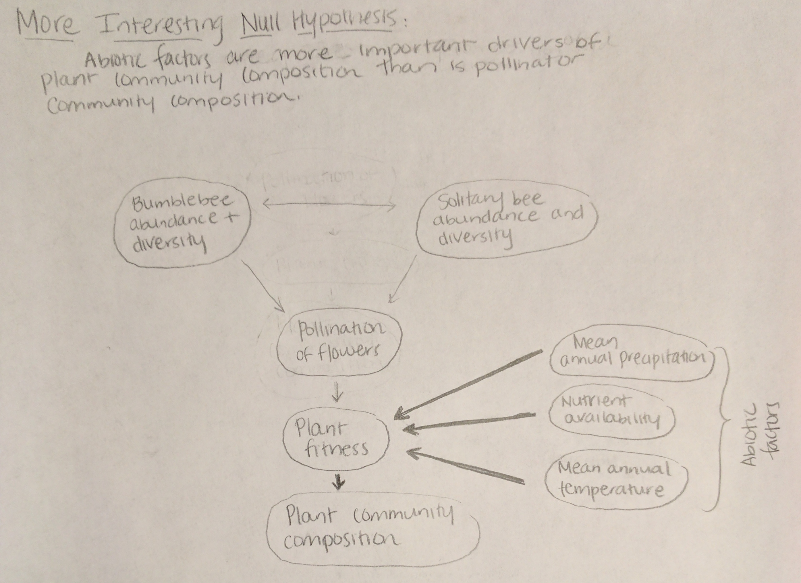

####Tool 1: Path Diagram
This path diagram illustrates how pollinator community composition (as influenced by diversity and abundances of bumblebees and solitary bees) may influence plant community composition.

####Tool 2: More Interesting Null Hypothesis
This more interesting null hypothesis contrasts with the hypothesis detailed in the path diagram above. Thicker lines represent a stronger relationship between variables.

####Tool 3: Lookup Table
This lookup table highlights possible answers to the question of whether there are relationships between solitary bee abundance and a) abundances of other bees, b) total pollinator visitation to focal plants in a study, and c) seedset of the focal plants. Some of the interpretations need to be revised; this was a useful exercise in beginning to think more thoroughly through how to interpret potential results.

####Tool 4: Logic Tree
This logic tree addresses the same question as the lookup table above. Similarly, some of the interpretations need to be revised; this was a useful exercise in thinking more thoroughly through the interpretation of potential results.  

