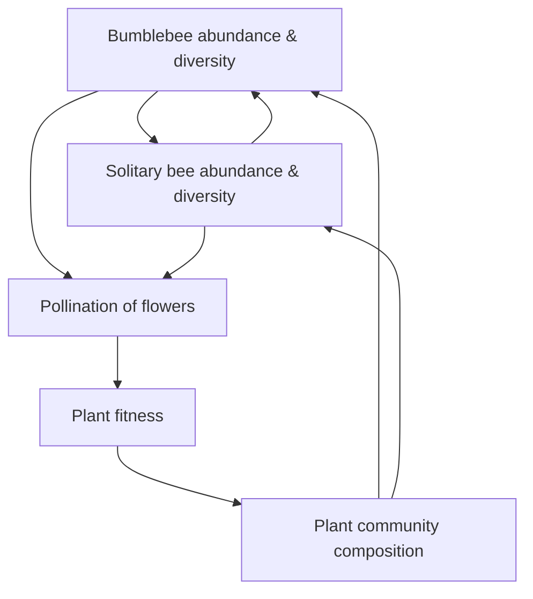

```mermaid
graph TD
A[Bumblebee abundance & diversity]-->B[Solitary bee abundance & diversity]
	B --> A
	A --> C[Pollination of flowers]
	B --> C
	C --> D[Plant fitness]
	D --> E[Plant community composition]
	E --> A
	E --> B
	
   
  
```